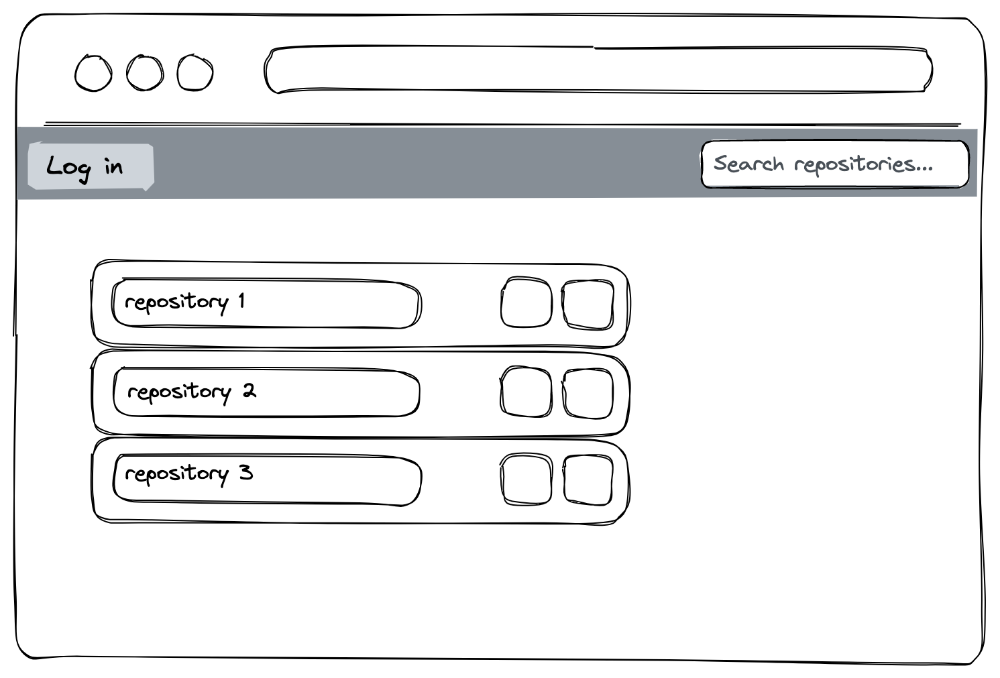

# Next.js recruitment task app

## Packages included

- [Next-Auth.js](https://next-auth.js.org)
- [Prisma](https://prisma.io)
- [TailwindCSS](https://tailwindcss.com)

## Issue at hand

We want to build an application using React and TypeScript, that communicates with [github REST API](https://swapi.dev/) to fit particular requirements:

## Requirements

1. The user can see a search bar by default.
2. Input in the search bar should filter through github repositories
3. The names and owners of the repositories should be displayed in a list
4. Clicking on any repository should redirect to a page containing more data about the repository
5. The user should be able to log in via a 'Log in' button using GitHub OAuth
6. After logging in, the application should prefill the search bar with the latest query of the user
7. User should be able to log out

## Important note

You're not expected to fulfill the whole task. It's quite lengthy, especially if you dive deep into styling. We know that interviews are stressful, and that there might be things you can struggle with. At the very least, we're looking for an insight into your problem solving skills, and a little bit of styling know how. So **make sure you leave yourself some time to implement some basic styling**.

## Available tools

Anything, really. You're free to look through documentation, google search solutions, add your own packages to make fetching easier (like `use-query`, `axios` or `useswr`). In fact, the simpler you can make it, the better. Show us your preferred stack, and let's learn from each other!

The only **requirements** are that you should stay within **React for your framework, styled-components for styling and TypeScript for your language** We have provided all of those packages in the app.

## What are we looking for?

- communication - more than anything else, we value communication; we welcome you talking us through (the more you explain to us, the better!); we would find it surprising if you had no questions before executing the task
- tooling proficiency - show us you know the tools you're using and can pick the best one for the task
- app performance - we don't expect you to implement all of the optimizations, but if you talk us through issues in your solution, it will be a big bonus

## Visual guide

